# Finding Lane Lines on the Road

## Overview

In this project, I'm going to identify lane lines on the road. The lane lines could be white or yellow in color. The distance between dashed lane lines also needs to be accounted. The lane lines may have the shadow of nearby objects like trees on them.

Following are some of the images used for testing the pipeline:
<table style="text-align:center;font-size:11pt">
<tr>
<td style="width:50%"><br>Img1: White lane lines</td>
<td style="width:50%"><br>Img2: Yellow lane lines</td>
</tr>
<tr>
<td><br>Img3: Another white lane</td>
<td>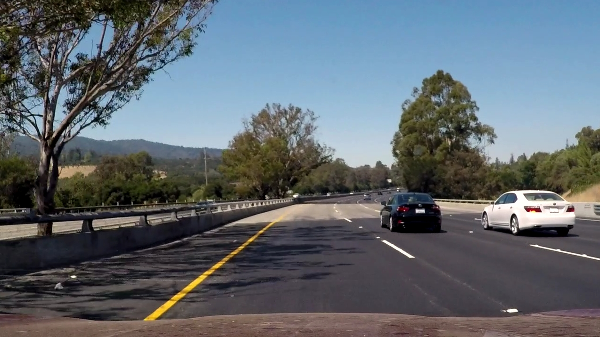<br>Img4: Shaded yellow lane</td>
</tr>
<tr>
<td>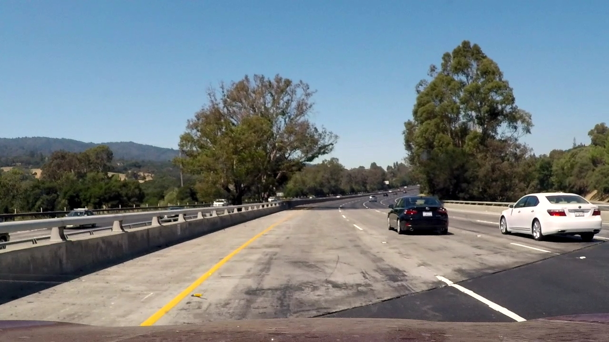<br>Img5: Changing road color</td>
<td>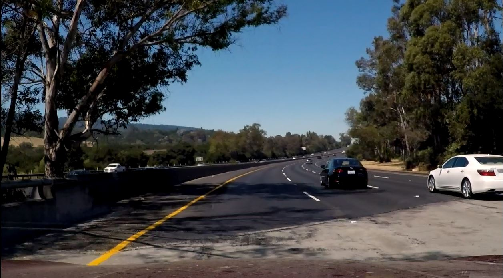<br>Img6: Shaded yellow lane with changing road color</td>
</tr>
</table>

## Pipeline Description

This pipeline consists of 6 steps:
1. Decide optimal color thresholds
2. Decide region of interest
3. Mask out unwanted colors and region
4. Detect edges in masked image
5. Apply Hough transform to get the lines for edges
6. Average the lines to get two lane lines and overlay on original image

### 1. Decide optimal color thresholds

Color thresholds for each of red, green and blue color are decide by using the following formula:
`\begin{equation*}
colorThreshold = regularColorThreshold - \frac{(regularMedianColor - imageColorMedian)}{effectFactor}
\end{equation*}`
Here *regularColorThreshold* is the threshold color value chosen for an image having median color equal to *regularMedianColor* approximately. *imageColorMedian* is the median of a color in current image. *effectFactor* is used to decide the effect of difference between color median of current and standard image on the regular threshold value.

This formula could help to calibrate the color intensities moderately in different lighting conditions.

### 2. Decide region of interest

Region of interest is the triangular region starting from the base of the image extending to half of the height of image. Lane lines are identified inside this region only.

### 3. Mask out unwanted colors and region

After the color and region thresholds are decided, now is the time to mask out the unwanted colors and region. Every pixel in image which has color intensity less than threshold is made black in color. All the pixels which fall out of the region of interest are also made black.

Following are the images after masking out the unwanted colors and area:
<table style="text-align:center;font-size:11pt">
<tr>
<td>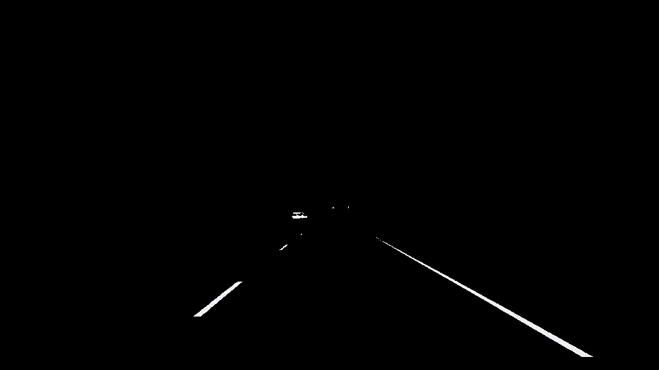<br>Img1: White lane lines</td>
<td>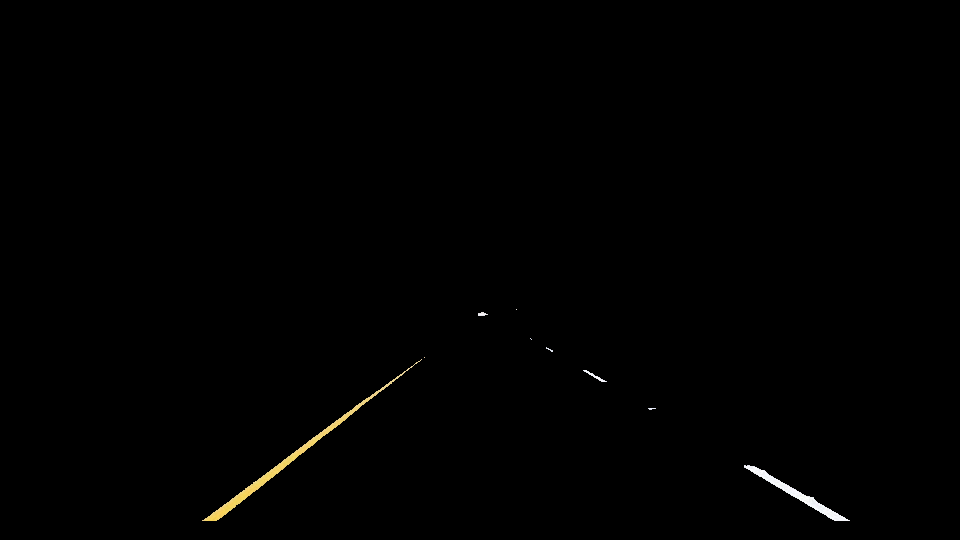<br>Img2: Yellow lane lines</td>
</tr>
<tr>
<td>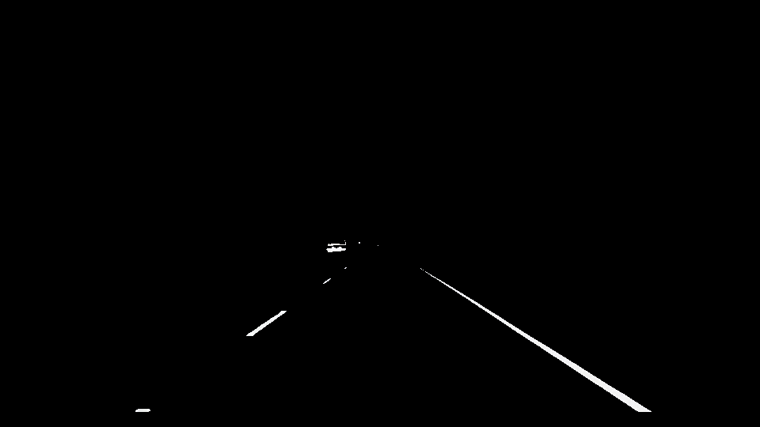<br>Img3: Another white lane</td>
<td>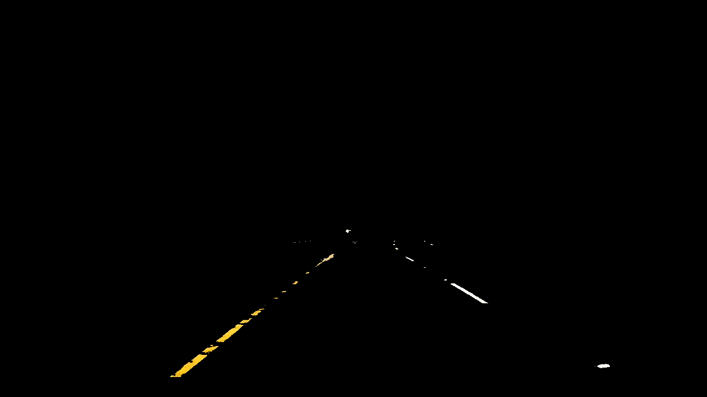<br>Img4: Shaded yellow lane</td>
</tr>
<tr>
<td>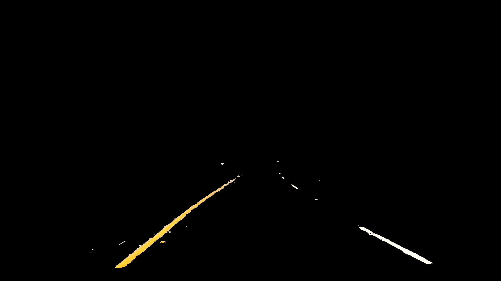<br>Img5: Changing road color</td>
<td>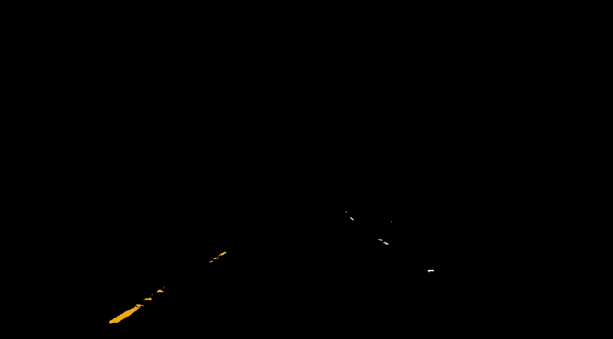<br>Img6: Shaded yellow lane with changing road color</td>
</tr>
</table>

### 4. Detect edges in masked image

The images, as seen above are now passed through canny edge detection function to get the image of edges. The image is blurred using gaussain blur algorithm before edged detection. Low and high thresholds for canny algorithm are calculated by taking median of single channel pixel intensities.

Following is the formula used:
$$
low\_threshold = \begin{cases}
    0                   & \quad \text{if } ((1.0 - sigma) * m) < 0\\
    (1.0 - sigma) * m   & \quad \text{if } ((1.0 - sigma) * m) >= 0
  \end{cases}
$$<br>
$$
high\_threshold = \begin{cases}
    255                 & \quad \text{if } ((1.0 + sigma) * m) > 255\\
    (1.0 + sigma) * m   & \quad \text{if } ((1.0 + sigma) * m) <= 255
  \end{cases}
$$

Here, _sigma_ is a constant whose value is taken as 0.33 for optimal results.
_m_ is the median of single channel pixel intensities in the image.
Following is the implementation of auto threshold canny function:


```python
def auto_threshold_canny(original_image, src_image):
    """ Compute the median of the single channel pixel intensities and
        use it to determine low and high thresholds for canny edge detection function.
    """
    m = np.median(original_image)
    sigma=0.33
    # apply automatic Canny edge detection using the computed median
    low_threshold = int(max(0, (1.0 - sigma) * m))
    high_threshold = int(min(255, (1.0 + sigma) * m))
    return canny(src_image, low_threshold, high_threshold)
```

Following are the images after edge detection:
<table style="text-align:center;font-size:11pt">
<tr>
<td>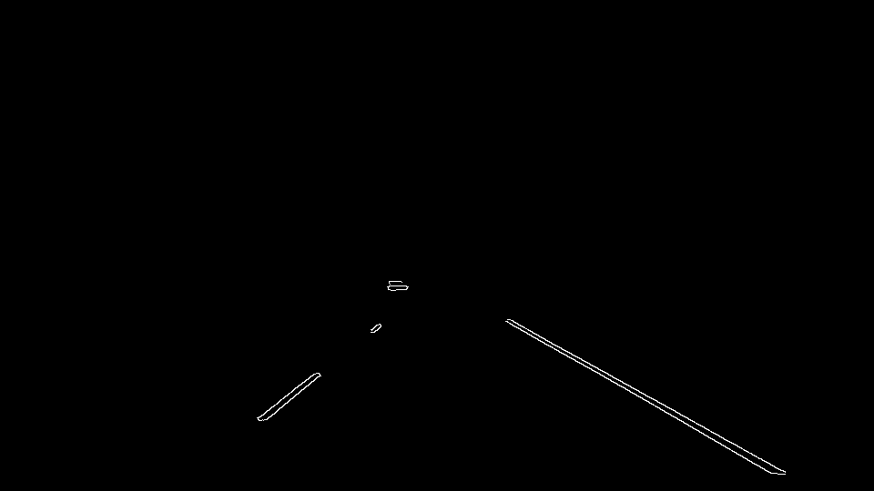<br>Img1: White lane lines</td>
<td>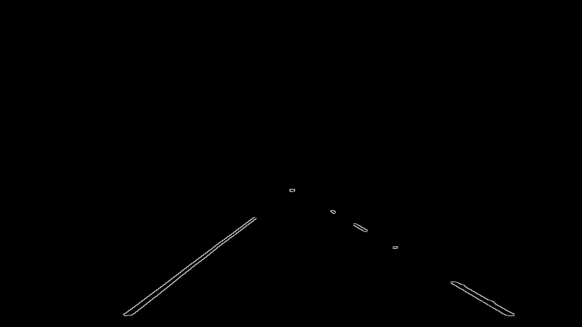<br>Img2: Yellow lane lines</td>
</tr>
<tr>
<td>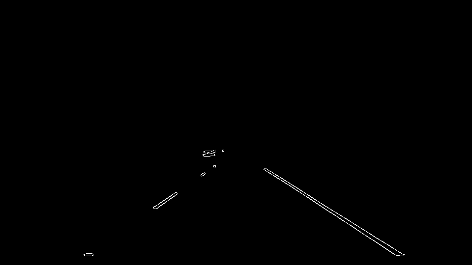<br>Img3: Another white lane</td>
<td>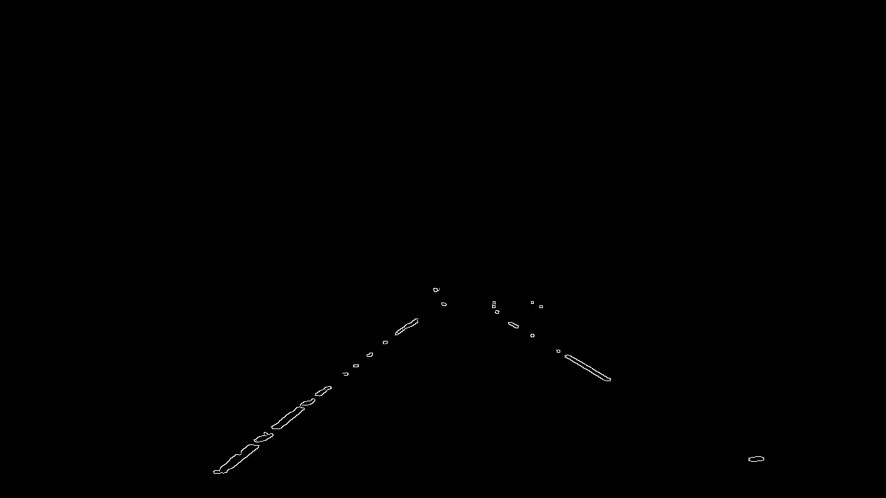<br>Img4: Shaded yellow lane</td>
</tr>
<tr>
<td>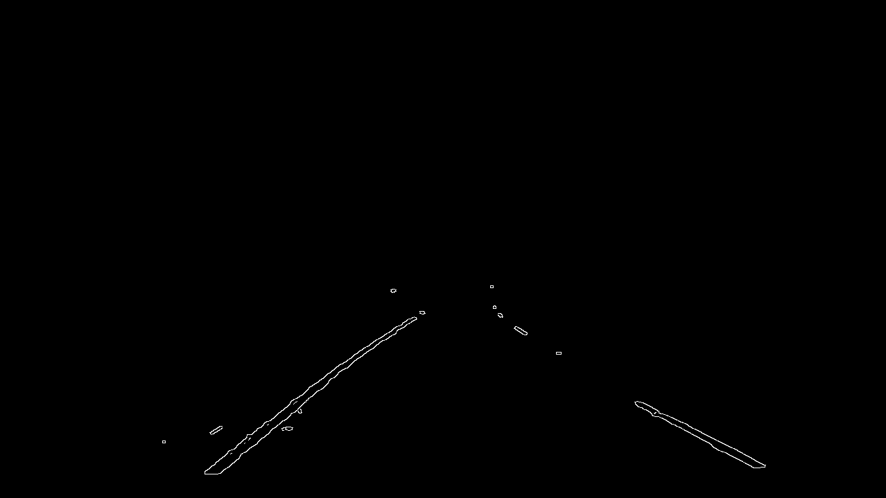<br>Img5: Changing road color</td>
<td>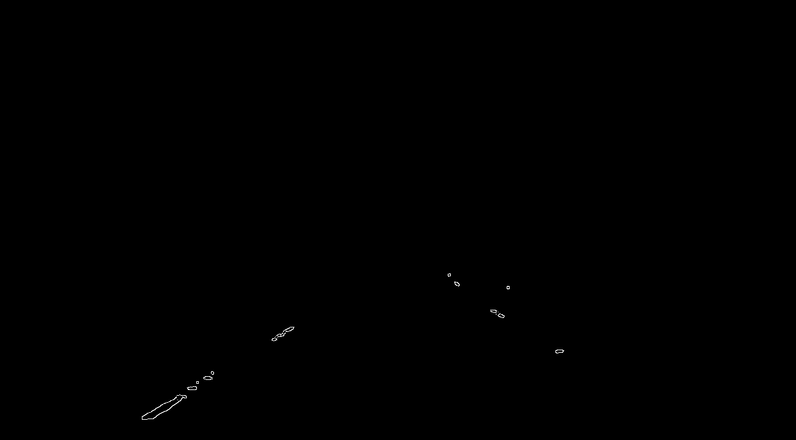<br>Img6: Shaded yellow lane with changing road color</td>
</tr>
</table>

### 5. Apply Hough transform to get the lines for edges

Hough transform is used on the edge detected images to draw lines parallel to the lanes. Parameters for hough transform are set so that smaller lines with wider gap are also merged into a single line. That helps to detect dashed lane lines with wider gap between them due to any reason in the image.

To draw lines, default `draw_lines` function is used directly on a copy of the original image.

Following are the images after drawing lines on copy of original image:
<table style="text-align:center;font-size:11pt">
<tr>
<td>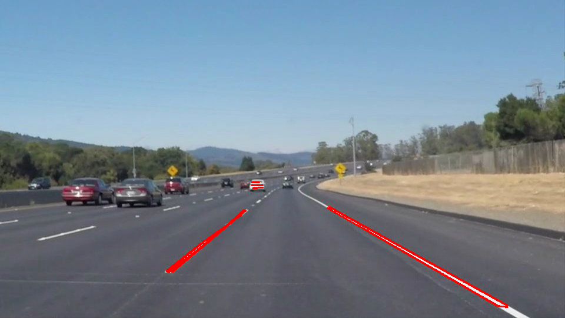<br>Img1: White lane lines</td>
<td>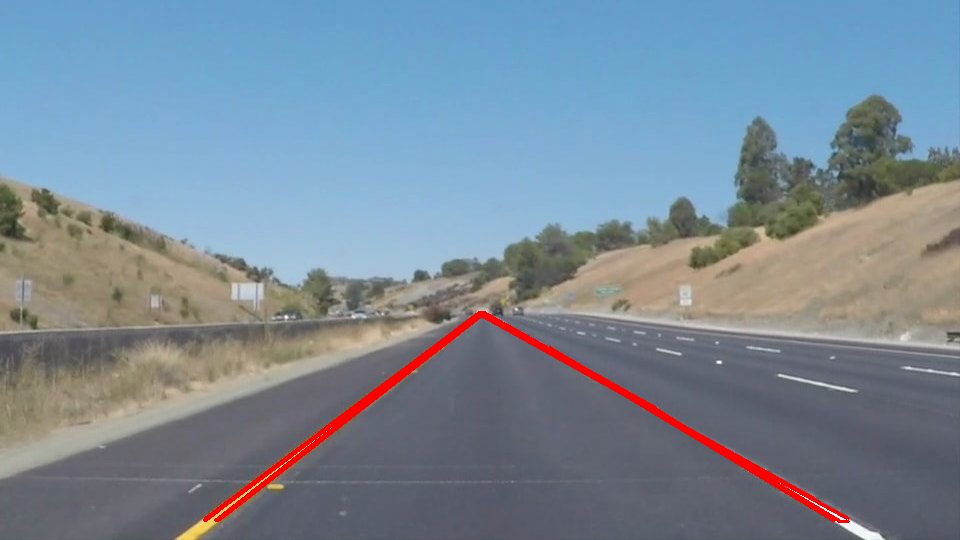<br>Img2: Yellow lane lines</td>
</tr>
<tr>
<td>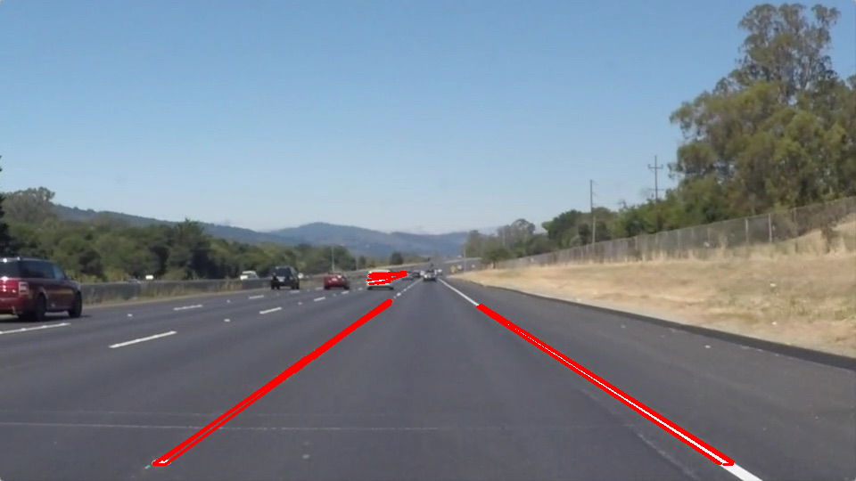<br>Img3: Another white lane</td>
<td>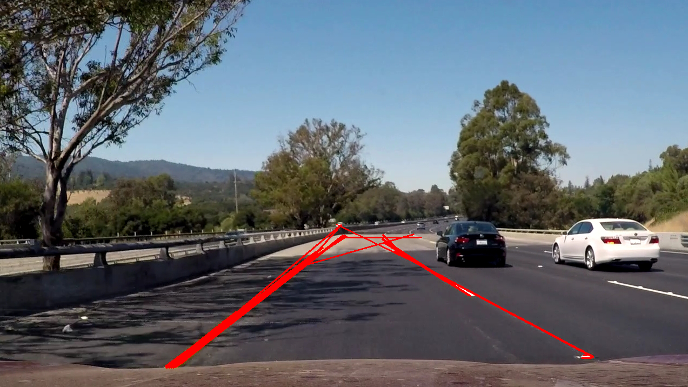<br>Img4: Shaded yellow lane</td>
</tr>
<tr>
<td>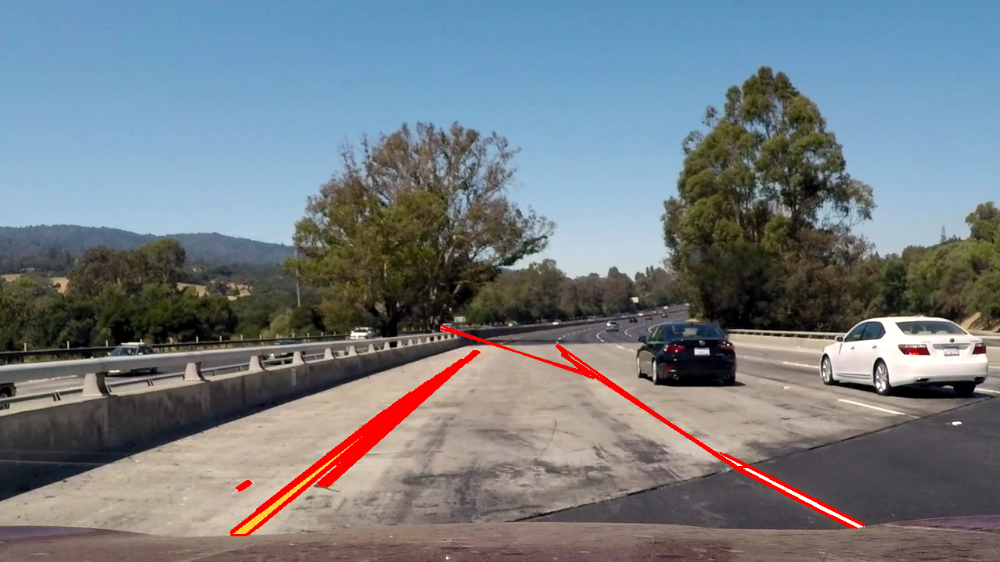<br>Img5: Changing road color</td>
<td>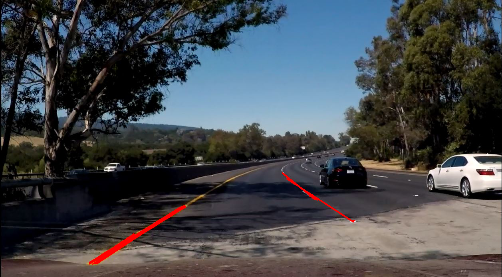<br>Img6: Shaded yellow lane with changing road color</td>
</tr>
</table>

### 6. Average the lines to get two lane lines and overlay on original image

As it is visible in the above images, the lines returned from hough transform are not aligned properly on the actual lanes because of noise or other factors in edge detected image. So these lines need to be averaged and extrapolated so as to cover entire lane line.

For averaging, slope, intercept and length of the detected lines are calculated using the equation of line: $y = mx + c$.
Length of the line is calculated using the formula: $length = \sqrt{(y2-y1)^2 + (x2-x1)^2}$.
Where `x1, y1` and `x2, y2` are the coordinates of lines returned by hough transform function.

Lines are averaged by calculating weighted averages for slopes and intercepts using length of lines as respective weights for positive and negative slopes. The lines drawn using averaged slope and intercept is the output.

Following images are the output of this pipeline:
<table style="text-align:center;font-size:11pt">
<tr>
<td>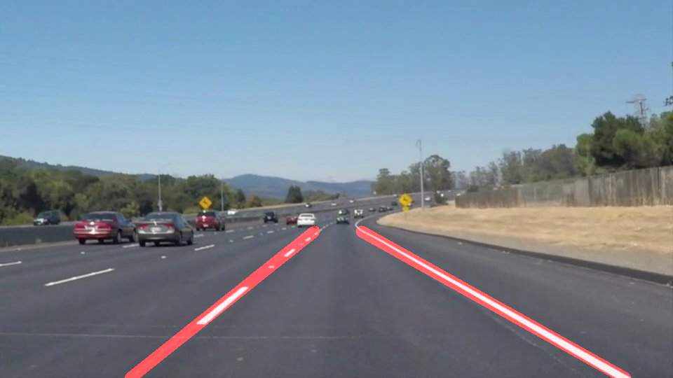<br>Img1: White lane lines</td>
<td>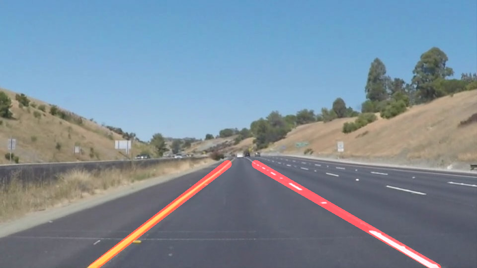<br>Img2: Yellow lane lines</td>
</tr>
<tr>
<td>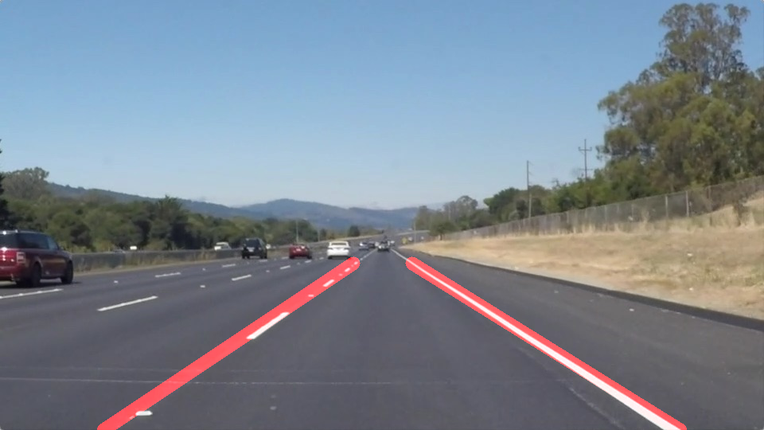<br>Img3: Another white lane</td>
<td>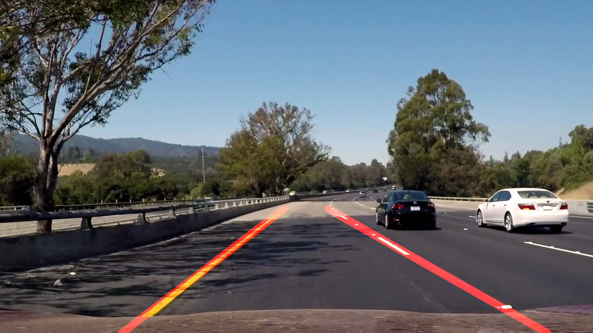<br>Img4: Shaded yellow lane</td>
</tr>
<tr>
<td>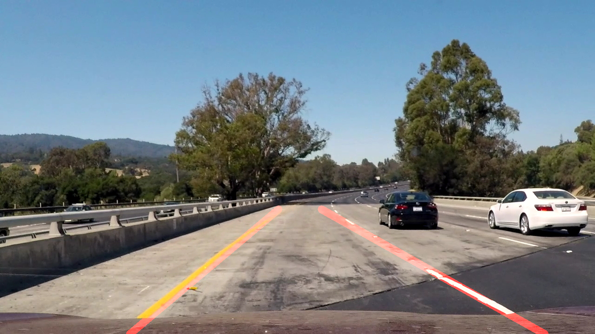<br>Img5: Changing road color</td>
<td>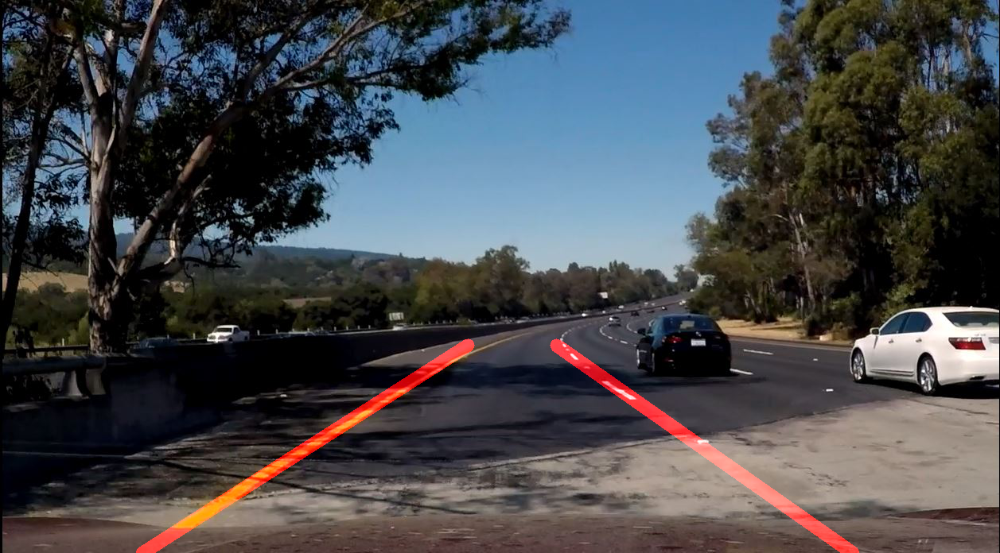<br>Img6: Shaded yellow lane with changing road color</td>
</tr>
</table>

## Pipeline Modifications for Video

For finding lanes in a video, most part of the pipeline remains same except for the averaging part before the final lines are drawn. There might be some of the following issues in processing the video:
1. minute glitches in individual frames due to noise, which could lead to flickering in the annotated lines in the output
2. possibility that hough tranform did not return any line for positive and/or negative slopes

So, to prevent these problems, averaging across past frames is also done after averaging hough lines for current frame.

But, simple averaging of annotation lines across past frames might lead to slightly inaccurate slope of these lines. To prevent that weighted average is used instead. Weights are taken in order or occurence of past 5 frames, i.e, if wieght of current frame is `5`, then weight of fifth last frame will be `1`.

Following is the output for video `challenge.mp4`.

<video width="960" height="540" controls>
  <source src="https://github.com/rahul1593/CarND_Term1_Finding_Lanes/blob/master/test_videos_output/challenge.mp4">
Your browser does not support the video tag.
</video>

Click to download: https://github.com/rahul1593/CarND_Term1_Finding_Lanes/blob/master/test_videos_output/challenge.mp4

## Potential Shortcomings of current pipeline

Following are the potential shortcomings which current pipeline doesn't address:
* The current pipeline works fine in average lighting conditions. Results might be totally different in low light
* The extrapolated lines are one third of the image height and region of interest is half of the image height, which may not work for up down roads.

## Possible Improvements in the pipeline

Following improvements could be made in the current pipeline:
* Considering the color of the road to predict the presence of road. This would eliminate the need for having hard coded region of interest
* Color spaces other than RGB, like HSV, could be used to improve the detection of yellow and white color in different lighting conditions.
* Grayscale image of original image can be used to improve performance.
